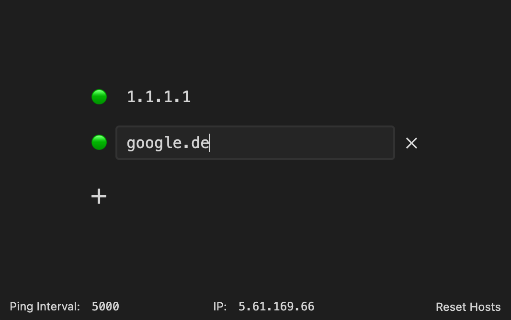

# are-we-online

> A small tool to place on your local/home webserver to display if different hosts are reachable.

---

## Screenshot



## Usage

Simply build it and upload to your local webserver.

Hostnames are interpreted as HTTPS URLs where protocol and port are added
automatically. If you want to use different port or protocol, just add them
directly to the hostname input (e.g. `http://whatever.foo:88`).

```sh
# develop
yarn start
# build
yarn build
# deploy
yarn deploy
```

## License and Author

[MIT &copy; Simon Lepel](http://simbo.mit-license.org/)
